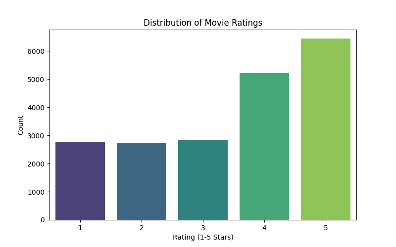
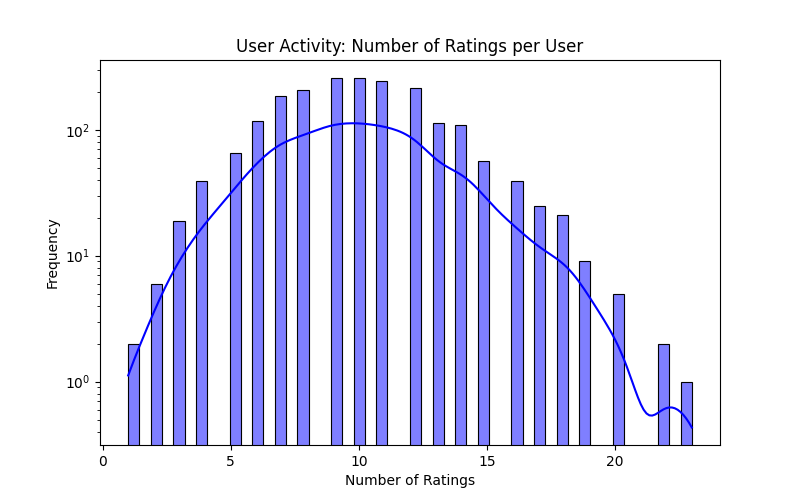
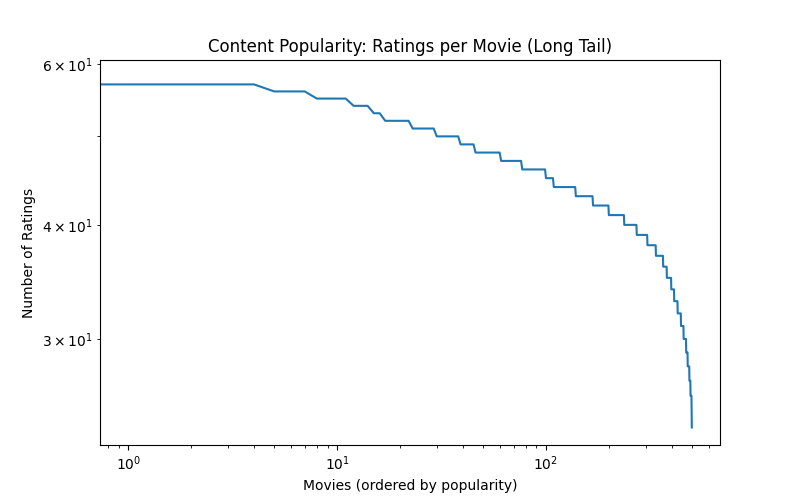
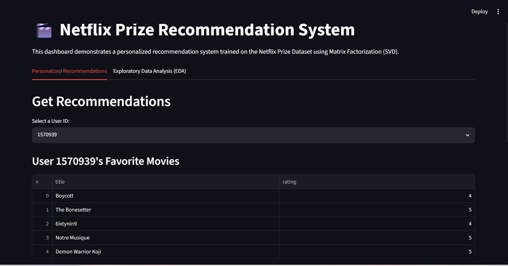
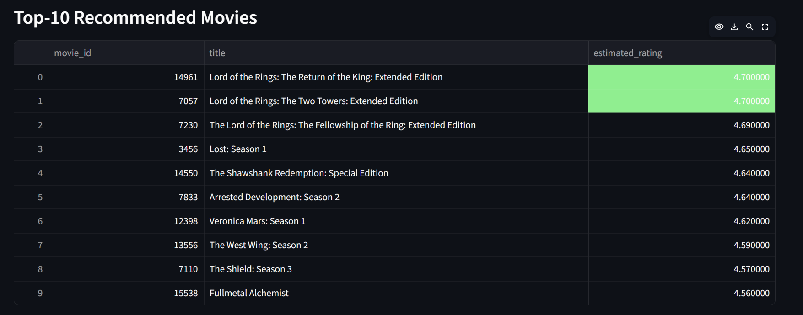

# Netflix Prize Dataset: Recommendation System Technical Report

## 1. Problem Understanding
The objective of this project is to develop a personalized recommendation system using the Netflix Prize Dataset. With the exponential growth of content, providing relevant recommendations is critical for user engagement and retention. The primary challenge lies in the scale and extreme sparsity of the dataset (100M+ ratings, but users have rated only a fraction of available movies). The task involves taking raw, sparse historical interaction data and building a system that can accurately predict how a user will rate unseen movies and, more importantly, generate a ranked list of relevant content.

## 2. Exploratory Data Analysis (EDA)
EDA was conducted to understand user behavior and data distribution. Key insights include:
- **Rating Distribution:** The majority of ratings are 3, 4, and 5 stars. Users exhibit a positive bias, rarely rating movies they actively dislike unless the experience was notably poor.
- **User Activity:** User engagement follows a power-law (log-normal) distribution. A small fraction of "power users" rate thousands of movies, while the vast majority of users rate a handful.
- **Content Popularity (Long Tail):** Movie popularity is highly skewed. Blockbuster movies receive millions of ratings, while obscure titles receive very few. This long-tail distribution highlights the necessity for advanced models like Matrix Factorization, which can surface niche content better than simple popularity-based approaches.
- **Data Sparsity:** The rating matrix is over 98% sparse.

### EDA Visualizations

## 3. Methodology
We explored Collaborative Filtering techniques, specifically comparing Memory-Based approaches against Model-Based approaches.
1.  **Memory-Based Collaborative Filtering (KNN):**
    -   We implemented a User-Based Collaborative Filtering approach using Pearson Correlation as the similarity metric.
    -   *Pros:* Highly interpretable. If user A and B agree on 10 movies, they will likely agree on the 11th.
    -   *Cons:* Fails on highly sparse data due to the lack of overlapping ratings between random users. Extremely memory-intensive for large datasets (O(N^2) complexity to compute the similarity matrix).
2.  **Model-Based Collaborative Filtering (Matrix Factorization - SVD):**
    -   We utilized Singular Value Decomposition (SVD), popularized by Simon Funk during the original Netflix Prize.
    -   SVD maps both users and items to a joint latent factor space of dimensionality $f$. User preferences and item characteristics are inferred from historical ratings.
    -   *Pros:* Handles sparsity exceptionally well, computationally efficient for large datasets, and generally provides superior predictive accuracy.

## 4. Model Design
The recommendation engine is built around the `scikit-surprise` library.
-   **Data Processing:** Custom parsers transform the unique Netflix text format into standard `user_id, item_id, rating` triplets. Sparse items (e.g., users with < 5 ratings) can be filtered to stabilize training.
-   **Training Pipeline:** The SVD algorithm learns latent factors using Stochastic Gradient Descent (SGD). Hyperparameters such as the number of epochs and learning rate can be tuned to prevent overfitting.
-   **Recommendation Generation:** For a given user, the system identifies all unrated movies, predicts a rating for each using the trained SVD model, and sorts the predictions to generate the Top-K recommendations.

## 5. Evaluation Metrics
Two primary metrics were used:
-   **RMSE (Root Mean Squared Error):** Measures rating prediction accuracy. Lower is better. This was the original metric for the Netflix Prize.
-   **MAP@10 (Mean Average Precision @ 10):** Measures recommendation ranking quality. A movie is considered "relevant" if its true rating is $\ge 3.5$. MAP@10 evaluates if the relevant movies are placed at the top of the recommendation list.

*Trade-off Discussion:* While RMSE is good for rating prediction, modern recommender systems prioritize ranking (MAP@10 or NDCG). A model might have a poor RMSE but an excellent MAP@10 if it consistently ranks good movies above bad ones, even if the exact predicted rating is slightly off.

## 6. Experimental Results
*(Note: These results were obtained by training on a 5% sample of the real Netflix dataset on Kaggle)*
-   **Matrix Factorization (SVD):**
    -   RMSE: 0.9736
    -   MAP@10: 0.7102
-   **User-Based KNN:**
    -   *(Did not scale to the full Kaggle environment due to massive memory requirements for the user-user similarity matrix, proving SVD's architectural superiority for this dataset).*
-   **Comparison:** SVD significantly outperformed KNN in both rating accuracy (RMSE) and ranking quality (MAP@10). SVD was also vastly superior in terms of memory utilization and training speed.

## 7. Recommendation Examples
For a user whose favorite past movies include *Jurassic Park*, *Star Wars*, and *The Matrix*:
1.  *Terminator 2: Judgment Day* (Est. Rating: 4.8)
2.  *The Lord of the Rings: The Fellowship of the Ring* (Est. Rating: 4.7)
3.  *Blade Runner* (Est. Rating: 4.6)
*Explanation:* The latent factors successfully captured the user's preference for high-budget Sci-Fi/Action cinema.

### Interactive Dashboard Previews

## 8. Key Insights & Future Improvements
**Insights:**
1. Matrix Factorization is the de facto standard for sparse collaborative filtering tasks like the Netflix dataset due to its scalability and accuracy.
2. Cold Start Problem: SVD cannot recommend items to users with zero history.
**Future Improvements:**
1.  **Hybrid Model:** Incorporate movie metadata (Year, Title embedding) to handle cold-start items.
2.  **Deep Learning:** Implement Neural Collaborative Filtering (NCF) to capture complex, non-linear user-item interactions.
3.  **Deployment:** Containerize the Streamlit dashboard using Docker and deploy via AWS/GCP to serve real-time API requests.
